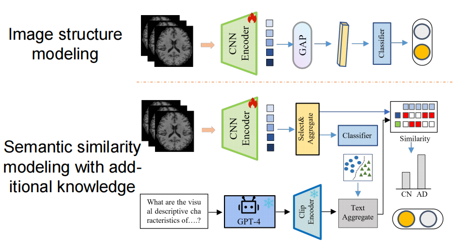
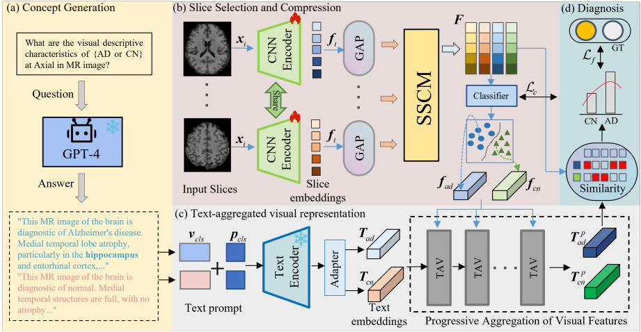
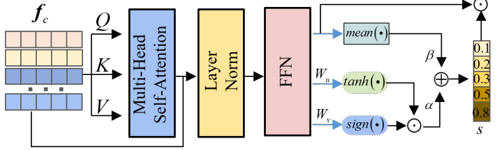
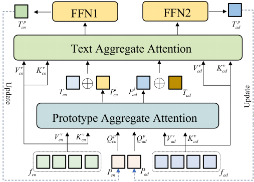

# PPAL: Prior-guided Prototype Aggregation Learning for Alzheimer's Disease Diagnosis

[](https://opensource.org/licenses/MIT) [](https://www.python.org/downloads/) [](https://pytorch.org/)

## 📋 Overview

PPAL is a state-of-the-art framework for Alzheimer's Disease (AD) diagnosis that bridges the semantic gap between MRI features and clinical concepts by leveraging Large Language Models (LLMs) to extract disease-related anatomical descriptions as prior knowledge.

### 🌟 Key Features

- **LLM-Guided Prior Knowledge**: Utilizes GPT-4 to extract disease-related anatomical descriptions
- **Progressive Feature Aggregation**: Bridges semantic gap between sMRI features and clinical concepts via multi-head cross-attention
- **Adaptive Slice Selection**: Prioritizes critical MRI slices for diagnosis using attention mechanisms
- **Zero-shot MCI Conversion**: Superior performance on mild cognitive impairment conversion tasks
- **Interpretable Results**: Provides attention visualizations and GradCAM++ heatmaps for clinical insights
- **CLIP-based Text Encoding**: Leverages vision-language models for semantic alignment

## 📊 Performance

Our method achieves state-of-the-art results on the ADNI dataset:

| Task | ACC | SPE | SEN | MCC |
|------|-----|-----|-----|-----|
| **AD vs CN** | 85.38% | 82.42% | 87.78% | 70.39% |
| **sMCI vs pMCI** (Zero-shot) | 67.19% | 65.64% | 68.83% | 34.47% |

## 🏗️ Architecture

The PPAL framework represents a paradigm shift from traditional image structure modeling to semantic similarity modeling with additional knowledge:


*Figure 1: PPAL leverages LLM-derived clinical knowledge for enhanced AD diagnosis*

### Framework Components


*Figure 2: Complete pipeline of the PPAL framework*

#### Detailed Module Architecture

<div align="center">
<table>
<tr>
<td></td>
<td></td>
</tr>
<tr>
<td align="center"><b>Figure 3: Slice Selection and Compression (SSC)</b><br/>Multi-head self-attention with adaptive slice weighting</td>
<td align="center"><b>Figure 4: Text-Aggregated Visual (TAV)</b><br/>Progressive prototype and text attention mechanisms</td>
</tr>
</table>
</div>

## 📁 Project Structure

```
PPAL/
├── docs/
│   └── images/               # Figures for documentation
│       ├── comparison.png
│       ├── pipeline.png
│       └── visualization_results.png
├── src/                      # Source code
│   ├── config/              # Configuration files
│   │   ├── __init__.py
│   │   ├── argparse_config.py
│   │   └── yaml_config.py
│   ├── data/                # Data loading and processing
│   │   ├── dataframe_loader.py
│   │   ├── dataloader.py
│   │   ├── dataset.py      # 3D MRI dataset
│   │   ├── dataset_2d.py   # 2D slice dataset
│   │   ├── split_data.py
│   │   └── transforms.py
│   ├── explainability/     # Interpretability modules
│   │   ├── attention/
│   │   │   ├── __init__.py
│   │   │   └── utils.py
│   │   └── cam/            # GradCAM visualization
│   │       ├── __init__.py
│   │       └── utils.py
│   ├── logger/             # Logging utilities
│   │   └── tensorboard_writer.py
│   ├── models/             # Model architectures
│   │   ├── __init__.py
│   │   ├── load_backbone.py
│   │   └── ppal.py        # Main PPAL model
│   └── mynn/              # Custom neural network modules
│       ├── attention_layer.py
│       ├── get_optimizer.py
│       ├── get_scheduler.py
│       ├── get_warmup_scheduler.py
│       ├── positional_encoding.py
│       └── transformer_block.py
├── template/               # MRI preprocessing templates
│   └── antsBrainExtraction/
├── engine3.py             # Training engine
├── experiments.py         # Experiment runner
├── preprocessing.py       # MRI preprocessing
├── utils.py              # General utilities
├── attention_xai_analysis.py  # Attention analysis
├── cam_xai_analysis.py   # CAM analysis
├── data_preprocessing.py # Data preparation
├── config.yaml          # Main configuration
├── textprompt.csv       # LLM-generated text prompts
├── checkpoint.txt       # Model checkpoints tracking
├── requirements.txt     # Dependencies
├── LICENSE
└── README.md
```

## 🚀 Quick Start

### Installation
```bash
# Clone the repository
git clone https://github.com/diaoyq121/PPAL.git
cd PPAL
# Create a virtual environment
conda create -n ppal python=3.8
conda activate ppal
# Install dependencies
pip install -r requirements.txt
# Install CLIP
pip install git+https://github.com/openai/CLIP.git
```

### Dataset Preparation

1. **Download ADNI Dataset**
   - Request access from [ADNI website](http://adni.loni.usc.edu/)
   - Download "ADNI1: Complete 1Yr 1.5T" dataset in BIDS format

2. **Preprocessing**
```bash
# Run preprocessing pipeline
python data_preprocessing.py --bids_path /path/to/ADNI_BIDS --n_proc 10

# This will:
# - Register to MNI152 template space
# - Apply N4ITK bias field correction
# - Perform affine registration
# - Strip skull
# - Generate dataset.csv for training
```

3. **Prepare Text Prompts**
   - Create `textprompt.csv` with AD and CN descriptive characteristics （Format: One row for AD description, one row for CN description）
   - These can be generated using GPT-4 with appropriate medical prompts

### Training

```bash
# Basic training for AD vs CN classification
python engine3.py \
    --gpu_idx 0 \
    --backbone VGG16 \
    --dataset ImageNet \
    --batch_size 4 \
    --num_slices 80 \
    --epochs 100 \
    --lr 1e-4 \
    --freeze_first_perc 0.75

# Training with specific experiment configuration
python experiments.py --config src/config/argparse_config.py

# Resume training from checkpoint
python engine3.py \
    --backbone VGG16 \
    --dataset ImageNet \
    --resume \
    --experiment_extra "resumed_training"
```

### Evaluation and Visualization

```bash
# Generate attention analysis
python attention_xai_analysis.py

# This will:
# - Run inference on test set
# - Generate attention weight histograms
# - Create explainable MRI visualizations
# - Compute XAI metrics
```

## 📈 Visualization

The framework provides comprehensive visualization tools for model interpretability:


*Figure 3: GradCAM++ attention heatmaps and slice attention weight distributions across three planes*

### Key Brain Regions Identified

| Brain Region | Overlap Volume | Overlap Percentage |
|--------------|----------------|-------------------|
| Hippocampus (R) | 1571 | 33.48% |
| Hippocampus (L) | 1536 | 32.72% |
| Parahippocampal (L) | 730 | 26.96% |
| Parahippocampal (R) | 532 | 19.65% |
| Amygdala (L) | 332 | 20.12% |


## 📝 Citation

If you find this work helpful, please cite our paper:

```bibtex
@article{diao2024ppal,
  title={Prior-guided Prototype Aggregation Learning for Alzheimer's Disease Diagnosis},
  author={Diao, Yueqin and Fang, Huihui and Yu, Hanyi and Wang, Yuning and Tao, Yaling and Huang, Ziyan and Yeo, Si Yong and Xu, Yanwu},
  journal={MICCAI2025},
  year={2024},
  url={https://github.com/diaoyq121/PPAL}
}
```

This project is licensed under the MIT License - see the [LICENSE](LICENSE) file for details.

